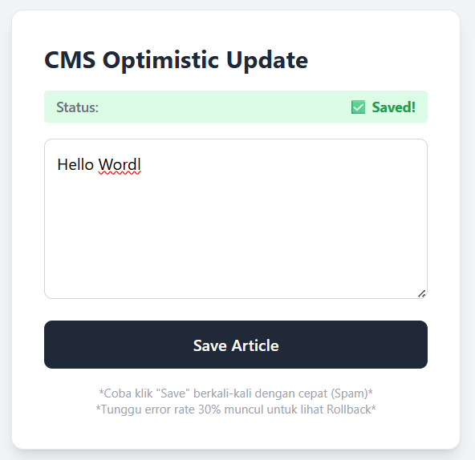
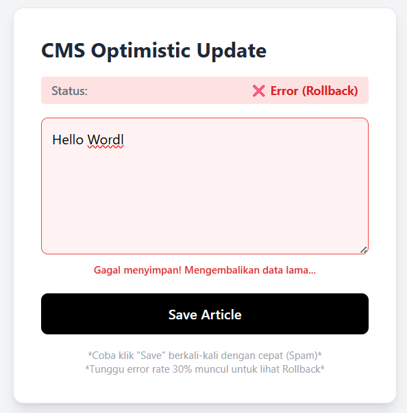
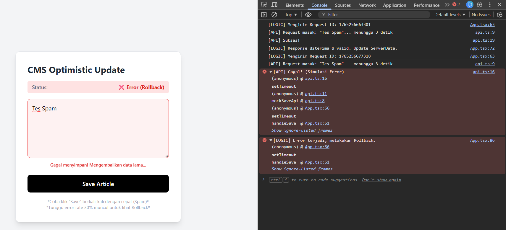

# CMS Optimistic Update & Race Condition Handling
**Tugas Individu - Romi Setiawan**

Repository ini adalah implementasi *Single Page Application* (SPA) sederhana untuk mensimulasikan CMS dengan fitur **Optimistic UI** dan penanganan **Race Condition** tanpa menggunakan UI Library pihak ketiga (Pure Logic & Tailwind CSS).

## 🚀 Fitur Utama

### 1. Optimistic UI Updates
UX Instant (0 detik). Saat tombol **Save** ditekan, UI langsung berubah seolah-olah data berhasil disimpan tanpa menunggu respons server. Jika server gagal, UI melakukan *Rollback* otomatis.

### 2. Race Condition Handling (Debounce)
Mencegah spam request. Jika user menekan tombol Save 5x dalam 1 detik, aplikasi hanya akan memproses klik terakhir.

### 3. Data Integrity & Rollback
Jika API mengembalikan error (Simulasi kegagalan 30%), aplikasi akan mendeteksi perubahan state dan mengembalikan data ke kondisi valid terakhir.

---

## 🛠️ Teknologi yang Digunakan
* **Vite** (Build Tool)
* **React + TypeScript (Strict Mode)**
* **Tailwind CSS** (Styling)
* **Mock API** (Custom Promise dengan delay 3s & random error)

---

## 📸 Screenshots

### 1. State Sukses (Optimistic -> Confirmed)
User melihat feedback instan saat data berhasil disinkronisasi.


### 2. Error Handling & Rollback
Simulasi error server (30%). UI otomatis kembali ke data lama dan menampilkan pesan error.


### 3. Logic & Race Condition Handling (Console)
Bukti *Debouncing* berjalan. Hanya 1 request yang dikirim meski user melakukan spam klik.


---

## 📦 Cara Menjalankan

1.  **Clone Repository**
    ```bash
    git clone https://github.com/rexxus166/cms-optimistic.git
    
    cd cms-optimistic
    ```

2.  **Install Dependencies**
    ```bash
    npm install
    ```

3.  **Jalankan Server**
    ```bash
    npm run dev
    ```